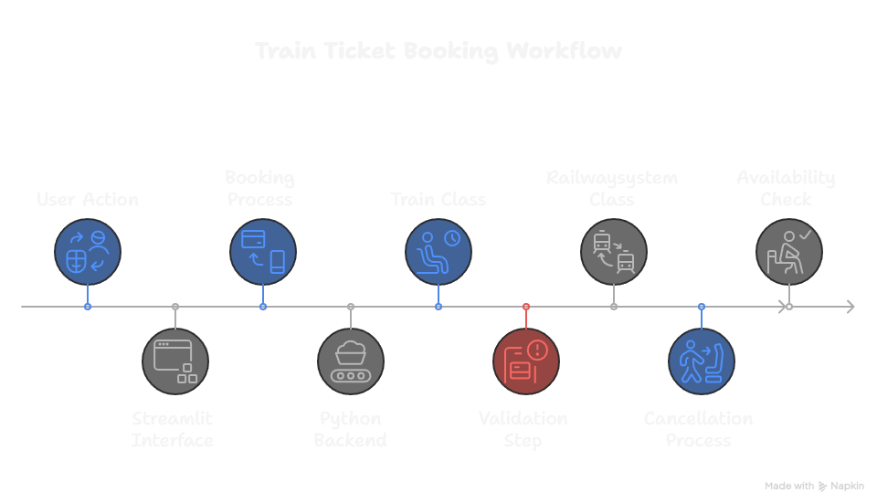

# Train ticket booking platform

A python-based web application built with streamlit for managing train ticket bookings. uses object-oriented programming to deliver robust booking, cancellation, and overbooking prevention with a seamless, interactive UI.

## Features
- **Real-time booking**: Check seat availability and book tickets instantly
- **Cancellation support**: Cancel bookings with immediate seat updates
- **Overbooking prevention**: Strict logic ensures no double-booking
- **Interactive UI**: Streamlit-powered interface for smooth user interactions
- **Modular design**: OOPS-based codebase for easy maintenance and scaling

## Tech stack
- **Python**: Core logic and scripting
- **Streamlit**: Web interface and UI framework

## Setup
1. Clone the repository:
   ```bash
   git clone https://github.com/urusername/train-ticket-booking.git
2. Navigate to the project folder:
   cd train-ticket-booking

3. Install dependencies:
   pip install -r requirements.txt

4. Run the application:
   python -m streamlit run app.py

5. Open the provided URL (typically http://localhost:8501) in your browser

## How it works


## Future enhancements & contributions
Enhance the app by adding a database (e.g., sqlite) for persistent storage, user authentication for secure access, or real-time notifications for bookings. Deploy it to a cloud platform like AWS or Heroku for production-grade scaling. Fork the repo, submit pull requests with features or fixes, or open issues for bugs and ideas!
